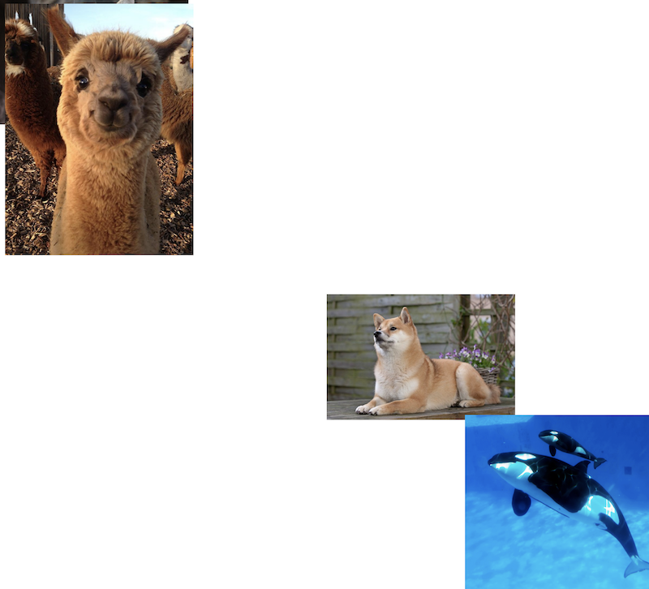

# 1.2 - CSS: The Basics - Workshop

_Unless specified in the exercise, don't worry about the fonts. Some of the screenshots were taken on Linux and the base system font is a little different._

## Exercise 1

- Open the provided index.html file in the browser.
- Modify the `style.css` file to match the following image


- background color is `blue`
- properties used: `padding`, `border`, `background`, `color`, `border-radius`.
  - HINT: you need to _remove_ the default border.
- Don't worry if your font looks different

## Exercise 2

- Open the provided index.html file in the browser.
- Modify the `style.css` file to match the following image


- Colors used are `pink` and `fuschia`
- text size is `5em` for the last line.
- Don't worry if your font looks different

## Exercise 3

- Open the provided index.html file in the browser.
- Modify the `style.css` file to match the following image


Properties you will likely need

```
font-size
font-style
font-family
text-align
```

- You will need to use the _Comic Sans MS_ font-family

## Exercise 4

The style.css file contains errors. Modify that file, and only that file, to produce the following output:


## Exercise 5

The style.css file has been corrupted. Repair the CSS so that the page matches the image below.


_No modifications to the HTML file._

## Exercise 6

Add the CSS needed to reproduce this page.


The exact measurements are not needed. Try and estimate the values (colors, font-sizes, etc).

## Exercise 7

Complete both the HTML and CSS files to reproduce the following web page:

_It isn't necessary to make it pixel perfect._


---

<center>🟡 - Minimally complete workshop (75%) - 🟡</center>

---

## Exercise 8

Update the CSS file to reproduce the following:


### Properties Needed

```
display
visibility
```

## Exercise 9

Update the CSS file to reproduce the following:



- The alpaca stays at the top left of the screen but must appear in front of the cat image
- The cat is moved to the top left of the screen
- The dog must be 50% away from the top and from the left of the screen and always stay there (even when scrolling down)
- The whales must be moved to the bottom left of the screen

### Properties Needed

```
z-index
top
left
position
bottom
right
```

---

<center>🟢 - Complete workshop (100%) - 🟢</center>

### Resources

- https://css-tricks.com/almanac/selectors/a/active/
- https://css-tricks.com/almanac/selectors/f/focus/
- https://css-tricks.com/almanac/properties/t/transition/
- https://developer.mozilla.org/en-US/docs/Web/CSS/transform-function/scale

---

### Links to more practice

- [CSS Selectors](https://flukeout.github.io/)
- [Flexbox](https://flexboxfroggy.com/)

## Additional Resources

- [Complete Guide to Flexbox](https://css-tricks.com/snippets/css/a-guide-to-flexbox/)
- [Flexbox.help](https://flexbox.help/)
- [Flexbox.ninja](https://flexbox.ninja/)

---

## Exercise 10 - Stretch

Using CSS, create a button that animates on hover:


- It should color to a dark-blue when focused. It should **not** have the typical "focus ring" (blue outline on MacOS, dotted outline on Windows).
- It should shrink when the mouse is held down on it.
- It should be animated

### Necessary properties/techniques

- You'll need the `:active` and `:focus` pseudoselectors
- You'll also need to use the `transform: scale` property for the size change, and the `transition` property for the animation.
- You can disable the outline with `outline: none`, but **you should only do this if you have an alternative focus state**. That outline is very important for keyboard users, to know which element is focused.
